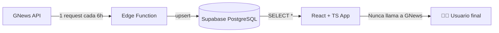

# ByteFeed

ByteFeed es una aplicación web open source que consume la API gratuita de **GNews** para mostrarte los últimos bombazos del mundo tech 🥳

Sin embargo, ¡El plan gratuito de GNews solamente ofrece 100 requests por día! 😨. Asi que, mediante una **Edge Function** que se ejecuta cada 6 horas, ¡ByteFeed almacena las noticias de GNews en su propia Base de Datos en **Supabase** de forma automática!, asegurando que nuestros lectores estén al día con lo último de lo último sin tener que pagar un solo dólar 🤠

    "Porque el conocimiento sobre tecnología, no debería depender de cuotas."

</br>

## 🧠 ¿Cómo soluciona ByteFeed el límite de 100 peticiones diarias de GNews?

1. Ejecuta una **Edge Function** en Supabase **cada 6 horas** (cron job).

2. Esta **Edge Function** hace un llamado a la API de GNews por cada categoría de noticia: Tecnología, IA, Videojuegos y más.

3. Inserta los resultados en una tabla de **Supabase**.

4. la App consulta la base de datos y muestra todas las noticas registradas.

   **Resultado:** 10.000 usuarios pueden usar la App sin agotarse la cuota de GNews.

</br>

## 🛠️ Stack técnico

| Capa                           | Tecnología                                |
| ------------------------------ | ----------------------------------------- |
| Frontend                       | React 18 + TypeScript + Vite              |
| Backend (funciones serverless) | Supabase Edge Functions                   |
| Base de datos                  | Supabase (PostgreSQL)                     |
| Orquestación de tareas         | Supabase Cron (pg_cron o trigger cada 6h) |
| API externa                    | [GNews API](https://gnews.io/)            |

</br>


</br>

## 📦 Requisitos previos

- Node.js (v18 o superior)
- npm o pnpm o yarn
- Cuenta en [Supabase](https://supabase.com/) (gratis)
- API Key de [GNews](https://gnews.io/) (plan gratuito: 100 req/día)

</br>

## 🚀 Guía de instalación y ejecución

### 1. Clona el repositorio

```bash
git clone https://github.com/miguelb-dev/bytefeed.git
```

### 2. Configura las variables de entorno

Crea un archivo `.env` en la raíz (puedes guiarte de `.env.example`):

```env
VITE_SUPABASE_URL=https://tusubdominio.supabase.co
VITE_SUPABASE_ANON_KEY=tu_anon_key_publica
GNEWS_API_KEY=tu_api_key_de_gnews
```

### 3. Configura Supabase (tu base de datos)

Ejecuta este código en el **SQL Editor** de Supabase:

```sql
-- Tabla de noticias
create table public.news (
    id text not null,
    category character varying(50) not null,
    title text not null,
    description text null,
    content text null,
    url character varying(500) not null,
    image_url character varying(500) null,
    source_name character varying(100) null,
    published_at timestamp without time zone not null,
    created_at timestamp without time zone null default CURRENT_TIMESTAMP,
    constraint news_pkey primary key (id),
    constraint news_url_key unique (url)
) TABLESPACE pg_default;

create index IF not exists idx_news_category on public.news using btree (category) TABLESPACE pg_default;

create index IF not exists idx_news_published on public.news using btree (published_at desc) TABLESPACE pg_default;


-- Índice para búsqueda rápida por fecha
CREATE INDEX idx_published_at ON news(published_at DESC);
```

### 4. Habilita las extensiones necesarias

En Supabase, dirigete a SQL Editor y ejecuta el siguiente código:

```SQL
-- Habilitar pg_cron para programar tareas
CREATE EXTENSION IF NOT EXISTS pg_cron;

-- Habilitar pg_net para hacer peticiones HTTP desde PostgreSQL
CREATE EXTENSION IF NOT EXISTS pg_net;
```

### 5. Crea y desplega la Edge Function

1. En el Dashboard, ve a Edge Functions

2. Haz clic en Deploy a new function

3. Selecciona Vía Editor

4. Nómbrala: fetch-gnews

5. Pega el siguiente código:

```typescript
import { createClient } from "jsr:@supabase/supabase-js@2";

// Tipa el resultado de la consulta a la API de GNews
interface GNewsArticle {
  id?: string; // * Opcional porque a veces GNews no lo regresa
  title: string;
  description: string;
  content: string;
  url: string;
  image: string | null;
  publishedAt: string;
  source: {
    name: string;
    url: string;
  };
}

interface GNewsResponse {
  totalArticles: number;
  articles: GNewsArticle[];
}

// Función para generar un ID único basado en la URL
function generateIdFromUrl(url: string): string {
  let hash = 0;
  for (let i = 0; i < url.length; i++) {
    const char = url.charCodeAt(i);
    hash = (hash << 5) - hash + char;
    hash = hash & hash;
  }
  return Math.abs(hash).toString();
}

// Función para normalizar título
function normalizeTitle(title: string): string {
  return title
    .toLowerCase()
    .normalize("NFD")
    .replace(/[\u0300-\u036f]/g, "")
    .replace(/[^\w\s]/g, "")
    .replace(/\s+/g, " ")
    .trim();
}

// Función para verificar duplicados por título
async function isDuplicateByTitle(
  supabase: any,
  title: string,
  category: string,
): Promise<{ isDuplicate: boolean; existingId?: string }> {
  const normalizedNewTitle = normalizeTitle(title);

  const { data: existingArticles, error } = await supabase
    .from("news")
    .select("id, title")
    .eq("category", category)
    .limit(20);

  if (error || !existingArticles || existingArticles.length === 0) {
    return { isDuplicate: false };
  }

  for (const existing of existingArticles) {
    const normalizedExistingTitle = normalizeTitle(existing.title);

    if (normalizedNewTitle === normalizedExistingTitle) {
      return { isDuplicate: true, existingId: existing.id };
    }

    if (
      normalizedExistingTitle.includes(normalizedNewTitle) ||
      normalizedNewTitle.includes(normalizedExistingTitle)
    ) {
      return { isDuplicate: true, existingId: existing.id };
    }
  }

  return { isDuplicate: false };
}

Deno.serve(async (req) => {
  try {
    const supabase = createClient(
      Deno.env.get("SUPABASE_URL")!,
      Deno.env.get("SUPABASE_SERVICE_ROLE_KEY")!,
    );

    const categories = [
      "technology",
      "artificial intelligence",
      "mobile",
      "cybersecurity",
      "games",
    ];

    const categoryStats: Record<
      string,
      {
        found: number;
        inserted: number;
        skippedById: number;
        skippedByTitle: number;
        errors: number;
      }
    > = {};

    let totalFound = 0;
    let totalInserted = 0;
    let totalSkippedById = 0;
    let totalSkippedByTitle = 0;
    let totalErrors = 0;

    for (const category of categories) {
      console.log(`Procesando categoría: ${category}`);

      const GNEWS_API_KEY = Deno.env.get("GNEWS_API_KEY");
      if (!GNEWS_API_KEY) {
        throw new Error("GNEWS_API_KEY no configurada");
      }

      const url = `https://gnews.io/api/v4/search?q=${encodeURIComponent(category)}&lang=es&country=any&max=100&token=${GNEWS_API_KEY}`;

      const response = await fetch(url);
      const data: GNewsResponse = await response.json();

      let categoryFound = data.articles?.length || 0;
      let categoryInserted = 0;
      let categorySkippedById = 0;
      let categorySkippedByTitle = 0;
      let categoryErrors = 0;

      if (data.articles && data.articles.length > 0) {
        for (const article of data.articles) {
          let articleId = article.id;

          if (!articleId || articleId.trim() === "") {
            articleId = generateIdFromUrl(article.url);
          }

          // Verificar por ID
          const { data: existingById, error: checkError } = await supabase
            .from("news")
            .select("id")
            .eq("id", articleId)
            .maybeSingle();

          if (checkError) {
            categoryErrors++;
            totalErrors++;
            continue;
          }

          if (existingById) {
            categorySkippedById++;
            continue;
          }

          // Verificar por título
          const { isDuplicate: duplicateByTitle } = await isDuplicateByTitle(
            supabase,
            article.title,
            category,
          );

          if (duplicateByTitle) {
            categorySkippedByTitle++;
            continue;
          }

          const { error: insertError } = await supabase.from("news").insert({
            id: articleId,
            category: category,
            title: article.title,
            description: article.description,
            content: article.content || article.description,
            url: article.url,
            image_url: article.image,
            source_name: article.source.name,
            published_at: article.publishedAt,
          });

          if (insertError) {
            console.error(`Error insertando:`, insertError);
            categoryErrors++;
            totalErrors++;
          } else {
            categoryInserted++;
          }
        }
      }

      categoryStats[category] = {
        found: categoryFound,
        inserted: categoryInserted,
        skippedById: categorySkippedById,
        skippedByTitle: categorySkippedByTitle,
        errors: categoryErrors,
      };

      totalFound += categoryFound;
      totalInserted += categoryInserted;
      totalSkippedById += categorySkippedById;
      totalSkippedByTitle += categorySkippedByTitle;
      totalErrors += categoryErrors;

      await new Promise((resolve) => setTimeout(resolve, 1000));
    }

    return new Response(
      JSON.stringify({
        success: true,
        timestamp: new Date().toISOString(),
        message: `Actualización: ${totalInserted} nuevas, ${totalSkippedById} por ID, ${totalSkippedByTitle} por título, ${totalErrors} errores`,
        summary: {
          totalFound,
          totalInserted,
          totalSkippedById,
          totalSkippedByTitle,
          totalErrors,
          categoriesProcessed: categories.length,
          details: categoryStats,
        },
      }),
      {
        status: 200,
        headers: { "Content-Type": "application/json" },
      },
    );
  } catch (error) {
    console.error("Error fatal:", error);
    return new Response(
      JSON.stringify({
        success: false,
        timestamp: new Date().toISOString(),
        error: error.message,
      }),
      {
        status: 500,
        headers: { "Content-Type": "application/json" },
      },
    );
  }
});
```

### 6. Configura la ejecución automática cada 6 horas

Ve a SQL Editor y ejecuta este código colocando tus datos reales

```SQL
  SELECT cron.schedule(
    'fetch-gnews-every-6-hours',  -- nombre del job
    '0 */6 * * *',                 -- cada 6 horas (00:00, 06:00, 12:00, 18:00)
    $$
    SELECT net.http_post(
      url := 'https://nomnczouyqxoujkaiciy.supabase.co/functions/v1/fetch-gnews',
      headers := jsonb_build_object(
        'Content-Type', 'application/json',
        'Authorization', 'Bearer TU_SERVICE_ROLE_KEY'
      ),
      body := '{}'::jsonb
    ) AS request_id;
    $$
  );

-- TU_PROYECTO_ID: En Dashboard → Project Settings → API → Project URL (es lo que está antes de .supabase.co)

-- TU_SERVICE_ROLE_KEY: En Dashboard → Project Settings → API → service_role key

```

### 7. Levanta el frontend localmente

```bash
npm install
npm run dev
```

Abre `http://localhost:5173` y deberías ver las noticias desde Supabase.

### 8. Despliega tus cambios

Puedes subir tu versión del proyecto a un repositorio en **GitHub**, y conectarlo a un servicio de frontend como **Vercel, Netlify, Cloudflare Pages** (solo necesitarías configurar tus variables de entorno de VITE).

</br>

## 🧱 Estructura del proyecto

```bash
bytefeed/
├───public/
├───src/
│   ├───assets/
│   │   ├───fonts/
│   │   ├───img/
│   │   └───styles/
│   ├───components/
│   │   ├───Card/
│   │   ├───ErrorMessage/
│   │   ├───Loader/
│   │   ├───Navbar/
│   │   └───NewsGrid/
│   ├───constants/
│   ├───hooks/
│   ├───lib/
│   ├───services/
│   └───types
└───supabase/
    ├─── functions/
    │    └─── fetch-gnews/               # Código de la Edge Function
    ├─── schemas/
    │    └─── schema.sql                 # Script para crear la BBDD
    └─── scripts/
         └─── tareas_y_peticiones.sql    # Script que habilita las tareas y peticiones HTTP
```

</br>

## 🔄 Flujo de datos completo



</br>

## 📜 Licencia

[MIT](/LICENSE) –> Tienes libertad de usar, estudiar, redistribuir y mejor este proyecto. Pero apreciaría, que aportes tu granito de arena compartiendo tus avances con la comunidad 💙🐧.

</br>

## 🐛 ¿Problemas?

Si la Edge Function no se ejecuta cada 6 horas, verifica:

- Que `pg_cron` esté habilitado.
- Que el cron job esté activo: `SELECT * FROM cron.job;`
- Logs de la función en **Supabase → Edge Functions → Logs**

¿Sigues con el problema? Abre un issue o haz un fork y parchea tú mismo 👨‍💻

</br>

**ByteFeed – Noticias tech infinitas y 100% gratis**
